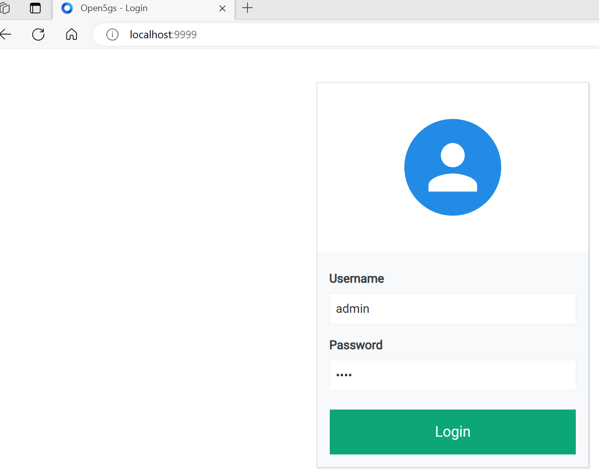

open5gs的官方源码中提供了docker的构造方法，不过他们的镜像我用着不顺手，我们利用它的DockerFile和compose来构造base镜像，然后自己写docker-compose.yaml。
## 首先，利用Open5gs官方Docker文件构造镜像
```bash
# 克隆open5gs代码
get clone git@github.com:open5gs/open5gs.git
cd open5gs/docker/
#注意不要用sudo或者root用户去build，否则会把报错，因为open5gs的docker构造中用到了用户名来设置某些参数（非常神经病的设计），用root的时候会报错，如果你的环境必须要用root的话，那么请根据报错改DockerFile吧
docker-compose build
```
这样会构成或者Pull出来5个image,其中xxx是用户名    
- xxx/ubuntu-latest-open5gs-dev  
- xxx/ubuntu-latest-open5gs-build  
- xxx/ubuntu-latest-open5gs-base  
- xxx/open5gs-webui  
- mongo  
## 然后，构造自己的docker-compose文件
官方的docker-compose.yaml我觉得不太好用，而且有错误，于是构造了自己的docker-compose文件，参考了[free5gc-compose](https://github.com/free5gc/free5gc-compose)，把所有网元都独立出来，好抓包。ueransim更是直接使用了free5gc的官方镜像。  

我构造了两种docker-compose.yaml，一种是各个网元是独立的一个IP的，这样抓包学习的话比较好抓，在./open5gs-compose文件夹下，另一种叫all in one的就是Open5gs所有网元all in one到一个容器，ueransim一个容器。两种镜像的用法都是一样的。  
以open5gs-compose为例  
```bash
cd ~/
get clone git@github.com:go1me:open5gs-compose.git
cd open5gs-compose/open5gs-compose/
docker-compose up
docker ps -a
```

注意以上容器启动命令不要用root用户或者sudo，如果一定要用，那么请编辑open5gs-compose.yaml，替换${USER} 为实际的容器镜像前缀，比如我这里是xxx  
查看容器是否启动成功，如果有未启动的容器，docker logs xxx 查看报错情况，定位解决  

## 核心网注册UE
然后登陆[http://localhost:9999](http://localhost:9999),用户名为admin,密码为1423  
  
然后选择Subscriber,点右下角红色加号

在IMSI 一栏输入：999700000000001，别的都不用动，点击SAVE 


## 进入UERANSIM容器启动UE
```bash
docker exec -it ueransim /bin/bash
#进入容器后，运行如下命令启动UE
./nr-ue -c ./config/open5gs-ue.yaml
```
ue 注册成功，并成功创建pdu会话


## 查看各个网元的ip

```bash
#查看创建的网络
docker network ls
NETWORK ID     NAME                         DRIVER    SCOPE
b68586e13384   bridge                       bridge    local
2063395cf3c1   host                         host      local
8dc9af294908   none                         null      local
fdd106cc2b4c   open5gs-compose_open5gsnet   bridge    local
```
```bash
docker network inspect open5gs-compose_open5gsnet
```

## 抓包
tcpdump或者wireshark抓 br-open5gs这个虚拟网卡  

## 停止容器
```bash
#docker-compose up 那个界面 Ctrl+c
docker-compose down
```

# 参考文献：  
- https://github.com/free5gc/free5gc-compose
- https://open5gs.org/open5gs/docs/guide/02-building-open5gs-from-sources/
- https://github.com/s5uishida/open5gs_5gc_ueransim_sample_config